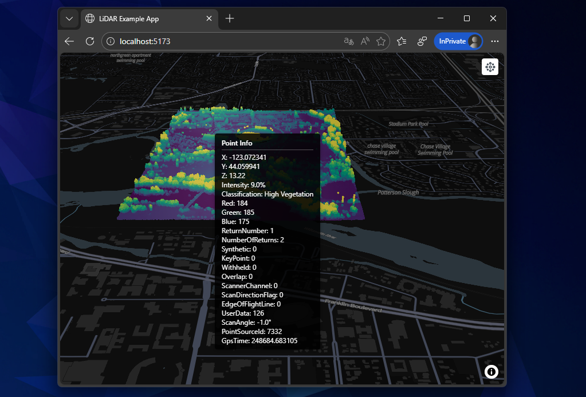

# maplibre-lidar

Exemple de création d'une application de visualisation de nuages de points Entwine basée sur le package `maplibre-lidar`.  



### Quickstart

```bash
git clone /this_repo/
npm install
npm run dev 
```

### Configuration complète
```bash
# Download and install nvm
curl -o- https://raw.githubusercontent.com/nvm-sh/nvm/v0.39.7/install.sh | bash
source ~/.bashrc

# Install Node.js
nvm install --lts
nvm use --lts
node -v

# Create project
cd ~/workspace
npm create vite@latest lidar_example -- --template vanilla
cd lidar_example

# Install deps
npm install maplibre-gl maplibre-gl-lidar
npm run dev
```

